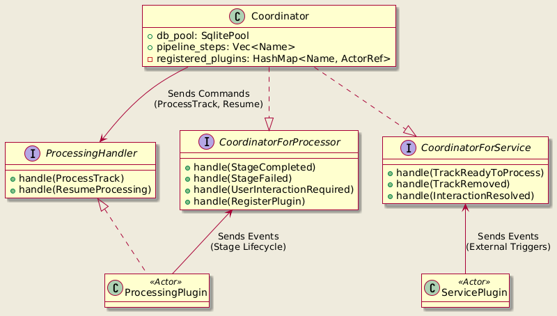
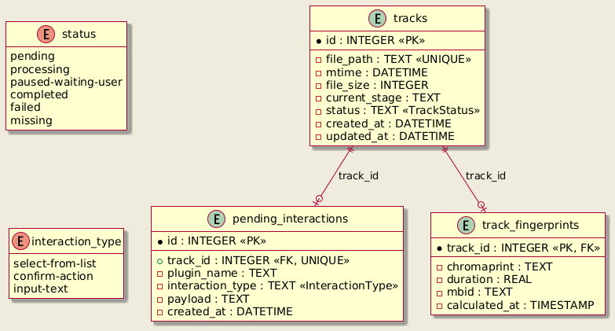
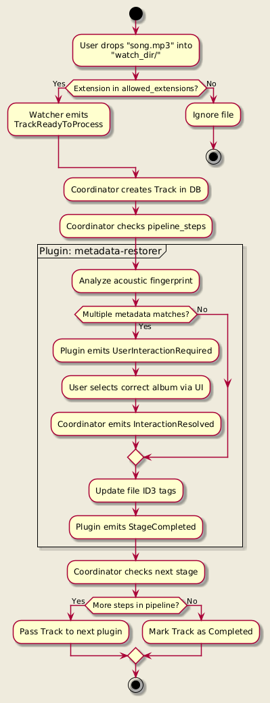
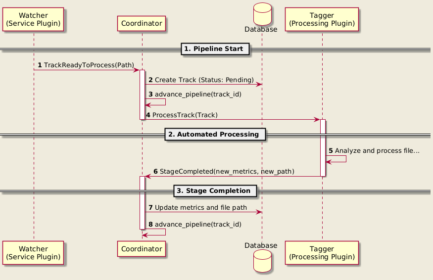
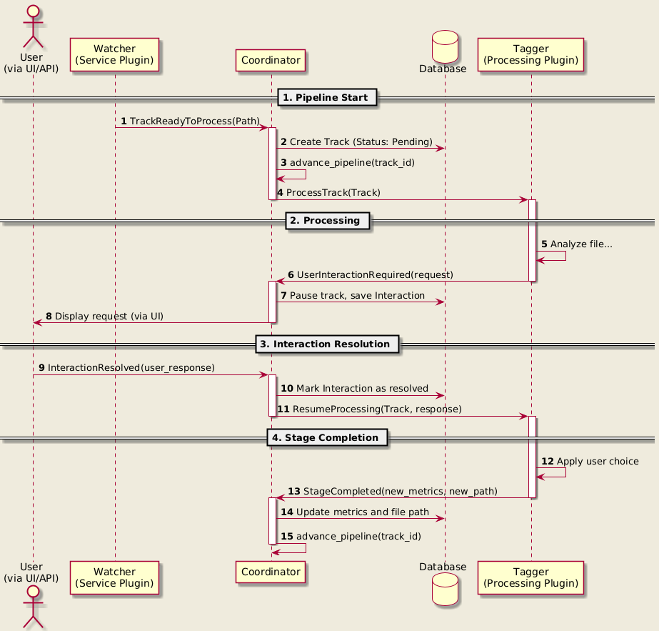
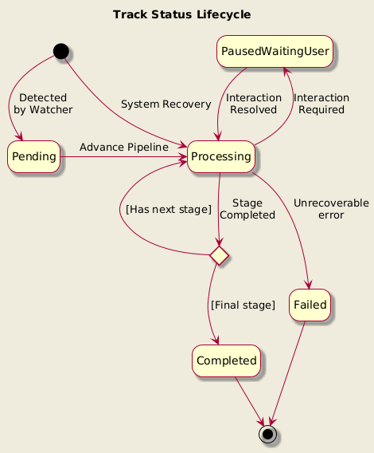

# Music Manager 😮‍💨🎼

## system Architecture

## Data Model

## An example of a track's lifecycle

## Actor Interaction Details

### Happy Path

### User Interaction Required

### Crash Recovery

## 🏗️ Project Roadmap
### Core System & Architecture
- [x] **Actor-based Orchestration**: Centralized Coordinator managing track lifecycles.
- [x] **Plugin System**: Support for independent Service and Processing plugins.
- [x] **State Management**: Persistence for tracks, stages, and interactions using SQLite.
- [x] **Lua Configuration**: Dynamic pipeline and plugin settings via Lua scripts.
    - [ ] Support for nested tables in configuration.
- [x] **Crash Recovery**: Automatic resumption of orphaned tracks on system start.

### Connectivity & Control
- [x] **Watcher Service**: Filesystem event-based track detection.
- [ ] **IPC Service Plugin and CLI**: Command-line interface for coordinator management.
- [ ] **Subsonic API Service**: Compatibility layer for music clients.

### Processing Enhancements
- [x] **Metadata Restorer**: Acoustic fingerprinting and metadata retrieval (AcoustID/MusicBrainz).
    - [ ] Expand metadata coverage based on full MusicBrainz payloads.
- [ ] **Lyrics Downloader**: Automated fetching and embedding of song lyrics.
- [ ] **Transcoding Plugin**: Automated audio format conversion (e.g., WAV to FLAC).
